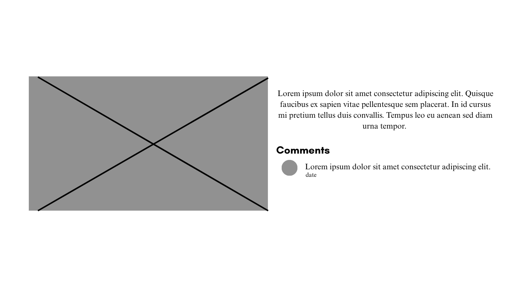

# WDProjBerylliumPanaoTamon

---

## FINAL MODIFICATION PROPOSAL
The final modification of our project includes public comments users can publish in the gallery section of our website. In each photo, there will be a comment section with the description where users can share their thoughts, knowledge, or even simply interact with other users. This can help develop new knowledge, insights, and connections through Shakespeare. Users can also edit or delete their comments anytime, which is how data in localStorage can be updated or removed.

## Website Title
### **Shakespeare’s Quill**
A concise, memorable title that reflects the site’s devotion to **William Shakespeare’s creative legacy**.  
It will appear on the browser tab and serve as the consistent header title across all pages.

---

## Secondary Title
### *Unlock the Bard’s World: Explore Timeless Tales and Wisdom*
A captivating tagline inviting visitors to rediscover Shakespeare’s timeless genius and his lasting influence on literature, art, and culture.

---

## Logo Design
The logo features a **stylized quill pen** resting diagonally across a soft circular background, symbolizing Shakespeare’s dual nature as poet and playwright.  
Beneath the quill are the elegant initials **“WS”**, written in **Playfair Display** for a classic yet readable touch.

**Color Palette:**
- **Beige (#F5F5DC):** Background and parchment-inspired textures  
- **Navy Blue (#003366):** Header, navigation text, and logo outlines  
- **Forest Green (#228B22):** Section dividers, hover states, and highlights  
- **Muted Orange (#FF8C00):** Button accents, icons, and call-to-action highlights  

This palette combines the warmth of vintage parchment with vibrant contrast for readability and visual charm.

**Logo Usage:**
- **Favicon (32×32 PNG)** displayed on the browser tab  
- **Header logo** featured consistently on all website pages for brand unity  

---

## Website Description
**Shakespeare’s Quill** is a modern educational website dedicated to exploring the **life, works, and legacy** of William Shakespeare.  
It combines **interactive design**, **academic insight**, and **literary appreciation** to engage students, scholars, and enthusiasts alike.

Visitors can:
- Learn about Shakespeare’s biography and cultural background  
- Explore his plays and sonnets organized by theme or genre  
- Read and share famous quotes  
- Browse visual galleries and curated educational resources  

The website’s design evokes **classical beauty blended with modern accessibility**, inspired by Elizabethan art and theater aesthetics.

---

## Website Outline

The site follows a **multi-section layout** similar to the reference project (https://takuhaya123.github.io/Project_MgMananghaya/index.html), featuring a horizontal navbar, card-based sections, and a responsive footer.

### 1. Home
**Purpose:** Introduce visitors to the site and its purpose.  
- Full-width **hero banner** with a Shakespeare quote (*“All the world’s a stage…”*)  
- Brief overview and mission statement  
- Interactive cards linking to other pages (Biography, Works, Quotes)  
- “Explore Now” button in orange accent  

---

### 2. Biography
**Purpose:** Present Shakespeare’s life, career, and legacy in an engaging timeline.  
- **Interactive timeline** (powered by JavaScript)  
- **Sections:** Early Life, London Years, Later Works, and Legacy  
- Image cards featuring Stratford-upon-Avon and the Globe Theatre  

---

### 3. Works
**Purpose:** Explore Shakespeare’s plays and sonnets by genre.  
- Categorized tabs: *Tragedies*, *Comedies*, *Histories*, *Poems*  
- Hover-over summaries and links to full text or short analyses  
- Filter and search functionality for easier navigation  

---

### 4. Quotes
**Purpose:** Showcase Shakespeare’s timeless words.  
- Search bar and **random quote generator** (JavaScript)  
- Option to filter by play or theme  
- Quotes appear in animated cards with subtle fade-in effects  

---

### 5. Gallery
**Purpose:** Provide visual engagement through images and artworks.  
- Grid of **portraits, theater posters, and Elizabethan artifacts**  
- Lightbox view for enlarged images  
- Descriptive captions for educational context and information  

---

### 6. Resources
**Purpose:** Offer study materials and user interaction.  
- **Study guides, trivia quizzes, and educational links**  
- Contact form for user inquiries and feedback  
- Downloadable PDF resources (e.g., “Understanding Shakespearean English”)  

---

## Loading Page Design

To ensure a polished user experience, a **loading page** appears before the site fully loads, especially for slow internet connections.

### Visual Style
Inspired by **Elizabethan manuscript borders**, the loading screen uses a parchment background framed by **blue, green, and orange floral designs** (based on the reference border image).  

Centered on the screen:
🖋️ Shakespeare’s Quill
“Loading timeless tales…”

Typography: *Playfair Display*, navy blue (#003366)  
Animation:  
- The border fades in gently.  
- A small **quill icon** performs a subtle writing or rotation animation.  
- Once loading is complete, the border fades out to reveal the Home page.

---

### Hidden “Ophelia” Reference
A subtle nod to **Taylor Swift’s album _The Life of a Showgirl_**, referencing her song *“The Fate of Ophelia.”*  
During the loading screen, faint text briefly appears in cursive at the bottom corner:

> *“The fate of Ophelia whispers in the wings.”*

This Easter egg fits naturally within the Shakespearean theme — honoring *Hamlet’s* tragic Ophelia while bridging classical and contemporary artistry.

---

### Implementation
- File: `loading.html`
- Styles: `loading.css`
- Script: Included in `scripts.js`  
  - Uses `window.onload` event to fade out the loader once resources finish loading.  
- Border PNG and quill icon stored in `images/`.

---

## JavaScript Incorporation
JavaScript enhances the site’s **functionality** and **interactivity**.

**Key Features:**
- **Biography Page:** Interactive timeline pop-ups with event descriptions and links to related works  
- **Quotes Page:** Dynamic search and random quote generator with fade-in animation  
- **Loading Page:** Smooth fade transition between splash screen and Home page  

All JavaScript functions are stored in a single local file:  
📄 `js/scripts.js`

# Part 2 - Updated Project Proposal
# User Data System: The Shakespeare’s Quill Society

## Overview

To meet the Web Development project requirements, the **Shakespeare’s Quill** website will incorporate an interactive **user data system** known as the **Shakespeare’s Quill Society**. This feature allows visitors to create a personalized Shakespeare profile and maintain a digital reading journal directly on the site. By leveraging **JavaScript LocalStorage**, the system stores data locally on the user's device, ensuring persistence across browser sessions. This transforms the website from a static information hub into a **student-centered literary platform**, fostering active engagement with Shakespeare’s works.

## Purpose of the HTML Form

The HTML form acts as the entry point for users to join the **Shakespeare’s Quill Society**. Upon submission, it creates a **Shakespeare Reader Profile**, personalizing the user's experience across the website.

The form collects the following information:
- User's name
- Email address
- Favorite Shakespeare play
- Preferred genre (Tragedy, Comedy, History, Poetry)
- A short personal reflection on why they enjoy Shakespeare

This data is stored locally and used to generate tailored content on other site pages.

## Proposed Data-Driven Web Pages

Three new webpages will be integrated to support the user data system. These pages will seamlessly share and utilize the saved user data.

### `signup.html` — Join the Shakespeare’s Quill Society

This page hosts the primary **HTML form** for user registration, serving as the gateway to the website's interactive features.

#### Design & Functionality
- Styled as a **classical parchment** for thematic immersion.
- Includes input fields for all required user details.
- Features a prominent "Join" button in muted orange.

Upon form submission, JavaScript saves the data to LocalStorage for retrieval by other pages.

### `profile.html` — User Shakespeare Profile

This page retrieves and displays the user's personalized **Shakespeare Reader Profile** based on data from `signup.html`.

#### Purpose
- Showcases a customized welcome message incorporating the user's name.
- Highlights the user's favorite play, preferred genre, and personal reflection.
- Demonstrates effective data retrieval and meaningful application, aligning with project requirements.

### `journal.html` — Shakespeare Reader’s Journal

This page enables users to create, save, and review entries in their personal digital journal.

#### Purpose
- Allows writing and saving reflections, reactions, or interpretations of Shakespeare’s works.
- Supports multiple entries, stored locally for easy access.
- Provides a persistent digital notebook, representing the second instance of data utilization across pages.

## Data Storage System

All user data is managed via **JavaScript LocalStorage**, ensuring secure, device-based storage without external dependencies.

### Stored Data Elements
- User profile details (name, email, favorite play, genre, reflection).
- Journal entries (as an array of objects for multiple entries).

Data is structured as JSON objects for efficient retrieval and display.

### Example Data Structure
{
  "name": "Younger",
  "email": "youngerpanao@email.com",
  "favoritePlay": "Hamlet",
  "genre": "Tragedy",
  "reason": "I enjoy Shakespeare’s emotional storytelling.",
  "journalEntries": [
    {
      "date": "2023-10-01",
      "entry": "Hamlet’s soliloquy resonates deeply with themes of existential doubt."
    }
  ]
}